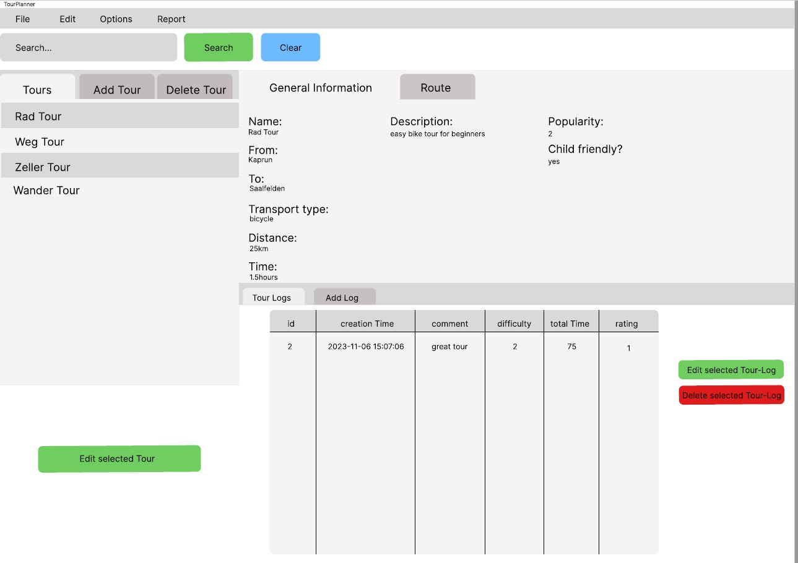

# Documentation
## GitHub repository:
https://github.com/Warteczek/TourPlannerUI.git
## Design and architecture

### UML

### Use Case Diagram

###	Communication between FXML files
For the communication the Observer Pattern was used, for example when a Tour is selected in the Observable List of Tours, 
a FXML-Loader gets notified to load the FXML files of the Tour Information and Tour-Logs.

The same pattern is used for the calculation of the Child-Friendliness and the popularity of a trip. Every time a new Tour-Log gets added
or a Log is deleted, the Observable List of Tour-Logs calls a function to calculate the values notifies the TourInformationController
to update the values.

### Unit test design

## Lessons learned

## Time spent

## Wireframes

